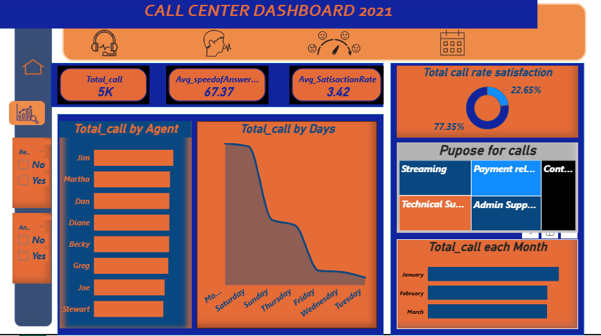

# Call Center Performance Dashboard

## 📊 Dashboard Preview

## ⬇️ Power BI File
You can download the Power BI dashboard here:  
[Download PBIX File](file/heart-attack-dashboard.pdf)

## 🌐 Portfolio Link
You can view this project as part of my portfolio here:  
👉 https://abdulfatai583.github.io

## 📌 Overview
This project analyzes call center operational data to evaluate agent performance, call handling efficiency, and overall service quality.  
The goal is to provide management with clear, data-driven insights to improve operational efficiency and customer satisfaction.

The analysis was performed using **Power BI**, with a focus on key performance indicators (KPIs) relevant to call center operations.

---

## 🎯 Objectives
- Analyze call volume trends across time and shifts  
- Evaluate agent performance and workload distribution  
- Measure call resolution efficiency and service quality  
- Identify operational bottlenecks and improvement opportunities  

---

## 🗂 Dataset Summary
The dataset contains call center operational records, including:
- Call volume and call duration  
- Agent identifiers and performance metrics  
- Call resolution status  
- Customer service indicators  
- Time-based attributes (date, time, shifts)  

---

## 🔧 Data Preparation
The following steps were applied during data preparation:
- Cleaning and formatting raw call records  
- Handling missing and inconsistent values  
- Creating calculated fields for KPIs such as call volume, resolution rates, and average handling time  
- Structuring the data model for efficient Power BI analysis  

---

## 📊 Key Insights
- Call volumes varied significantly by shift, highlighting peak operational periods  
- Certain agents handled a disproportionate number of calls, indicating workload imbalance  
- Higher call volumes were associated with longer handling times  
- Agent performance differences revealed opportunities for targeted training  

---

## 📈 Dashboard Features
- Call volume trends by date and shift  
- Agent performance comparison  
- Call resolution efficiency metrics  
- Interactive filters for time, agent, and call status  

---

## 🛠 Tools & Technologies
- **Power BI Desktop** – Data modeling, DAX measures, and dashboard creation  
- **Power Query** – Data cleaning and transformation  
- **Excel / CSV** – Initial data inspection  

---

## 📌 Notes
This project demonstrates practical use of data analytics to support operational decision-making in a call center environment, focusing on performance monitoring and service optimization.
